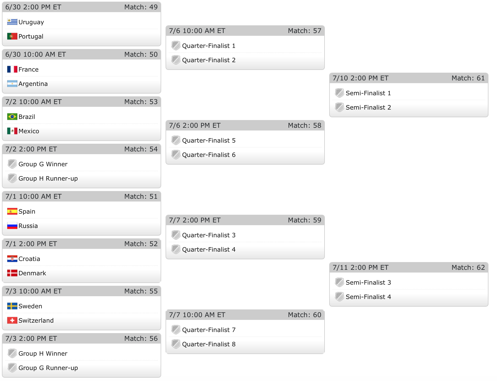

Former NFL head coach, and current Arizona State coach, Herm Edwards once famously said, ["you play to win the game."](https://www.youtube.com/watch?v=b5-iJUuPWis). Every once in a blue mood, Edwards' logic is actually false, and sometimes teams don't play to win--because they are incentivized NOT to win. At the 2012 Summer Olypmics, for example, several badmitton teams intentionally lost in hopes of [securing a more favorable draw through the knockout phases of the tournament](https://www.telegraph.co.uk/sport/olympics/badminton/9444025/Badminton-match-fixing-scandal-how-and-why-the-four-pairs-were-disqualified-from-the-London-2012-Olympics.html). 

There is speculation that we might see more of this when Belgium and England square off in the final match of Group G at the 2018 FIFA World Cup. Both squads come into the match with 2 wins apiece, having each already secured slots in the knockout round. All that remains to be determined is who will win the group, and who will finish as runner-up. Either squad would win the group if victorious, and since England and Belgium are tied on points, goal differential, and goals forced, meaning a draw would result in the group winner being decided via [FIFA Fair Play](https://www.thesun.co.uk/world-cup-2018/6613106/fair-play-ranking-points-world-cup-group-stages-germany/). This means that England would need to get at least 2 more yellow cards than Belgium to have any chance of advancing via a draw. Prior to Group G and H finishing, here's how the Knockout Round bracket is looking.


The top half of the bracket looks absolutely stacked compared to the bottom half of the bracket. [My World Cup model](http://rpubs.com/lbenz730/world_cup_model) produces net ratings and world rankings for each country, allowing us to examine the disparity between the two halfs of the bracket

__Top Half Rankings__

- Brazil 2.97 (1)
- France 2.92 (2)
- Portugal 2.63 (10)
- Uruguay 2.59 (12)
- Argentina 2.50 (14)
- Mexico 2.12 (25)

__Bottom Half Rankings__

- Spain 2.72 (6)
- Croatia 2.71 (7)
- Denmark 2.62 (11)
- Sweden 2.57 (13)
- Switzerland 2.33 (19)
- Russia 1.96 (35)

Are these groups really that different in talent? The average rating in the upper half of the bracket is 2.62, while the average team in the lower half of the bracket is 2.48 . Among teams to qualify for the Knockout Round, we can simulate the average talent disparity between the top half of the bracket, when the Group G winner will go, and the lower half of the bracket, where the Group G runner-up will go.

```{r, echo  = F, message=F, warning=F}
tmp <- rep(NA, 100000)
wc_sims <- read.csv("https://raw.githubusercontent.com/lbenz730/world_cup/3fca1243d8dbd67f560f7c7e29deb8037434f2e0/wc_sims.csv", as.is = T)
groups <- LETTERS[1:6]
rankings <- read.csv("https://raw.githubusercontent.com/lbenz730/world_cup/3fca1243d8dbd67f560f7c7e29deb8037434f2e0/rankings.csv", as.is = T)

samplegroup <- function(group) {
  teams <- wc_sims$country[wc_sims$group == group]
  firstprobs <- wc_sims$first_in_group[wc_sims$group == group]
  secondprobs <- wc_sims$second_in_group[wc_sims$group == group]
  first <- sample(teams, 1,  prob = firstprobs)
  second <- first
  while(second == first) {
    second <- sample(teams, 1,  prob = secondprobs)
  }
  return(c(first, second))
}

for(i in 1:100000) {
  winners <- rep(NA, 6)
  runners <- rep(NA, 6)
  for(j in 1:6) {
    tmp2 <- samplegroup(groups[j])
    winners[j] <- tmp2[1]
    runners[j] <- tmp2[2]
  }
  top <- c(winners[c(1,3,5)], runners[c(2,4,6)])
  bot <- c(winners[c(2,4,6)], runners[c(1,3,5)])
  tmp[i] <- mean(rankings$net_rating[rankings$team %in% top]) - mean(rankings$net_rating[rankings$team %in% bot])
}
hist(tmp, col = "forestgreen", xlab = "Average Talent Disparity Between Top Half and Bottom Half of Bracket", main = "Histogram of Talent Disparity in Simulated Draws") 
abline(v = 0.14, col = "black", lty = 2, lwd = 3)
abline(v = 0.25, col = "black", lty = 1, lwd = 3)
legend("topleft", legend = c("Observed Talent Disparity (Current Rantings)", "Observed Talent Disparity (Pre-Tournament Ratings)"), lty = c(3,1), lwd = 3, cex = 0.5)

```

In the histogram displaying talent disparities from 100,000 simulated knockout brackets based on pre-tournament probabilities to advance, we see that the disparity based on current ratings isn't that big. Perhaps the reason that we think the disparity is larger than it actually is that that big-name teams in the top-half of the bracket, namely Argentina, are worse than expected pre-tournament, while several teams in the bottom half, like Croatia, Sweden, and Switzerland, have all improved in rating since the beginning of the tournament. Irregardless, there is truth in the fact that the top half of the knockout break is stronger on average than the bottom half of the bracket. Let's see how England and Belgium fair based on which half of the bracket they are in to see if losing in order to finish second in Group G really is better. 


```{r, echo = F, warning = F, message  = F}
library(ggplot2)
library(dplyr)
eng_first <- c(0.639, 0.294,  0.137,  0.07)
eng_second <- c(0.59,  0.33,  0.173, 0.074)
belg_first <- c(0.66, 0.339,  0.178, 0.089)
belg_second <- c(0.657, 0.375,  0.208, 0.117)

eng_first_col  <- c(0.758, 0.346, 0.18, 0.103)
eng_second_col <- c(0.503, 0.277,  0.133, 0.073)
belg_first_col <- c(0.752, 0.337,  0.183, 0.098)
belg_second_col <- c(0.482, 0.272,  0.165, 0.081)

eng_first_col2  <- c(0.479,  0.23, 0.116, 0.054)
eng_second_col2 <- c(0.724, 0.406,  0.218, 0.098)
belg_first_col2 <- c(0.502, 0.234,  0.121, 0.063)
belg_second_col2 <- c(0.794,  0.46,  0.251, 0.13)

eng_first_colout  <- c(0.704, 0.335 ,  0.18, 0.085)
eng_second_colout <- c(0.63,  0.37, 0.2, 0.099)
belg_first_colout <- c(0.751, 0.376,  0.197,  0.11)
belg_second_colout <- c(0.685, 0.403,  0.201, 0.109)

data <- data.frame("finish" = rep(rep(c("England First", "England Second", "Belgium First", "Belgium Second"), 
                                  rep(4, 4)),4),
                   "round" = rep(c("Qtrs", "Semis", "Final", "Champ"), 16),
                   "prob" = c(eng_first, eng_second, belg_first, belg_second,
                            eng_first_col, eng_second_col, 
                            belg_first_col, belg_second_col,
                            eng_first_col2, eng_second_col2, 
                            belg_first_col2, belg_second_col2,
                            eng_first_colout, eng_second_colout, 
                            belg_first_colout, belg_second_colout),
                   "colresult" = rep(c("Colombia Result Unknown", "Colombia First", 
                                       "Colombia Second", "Colombia Out"),
                             rep(16, 4)))

subdata <- filter(data, colresult == "Colombia Result Unknown") %>% select(-colresult)
subdata1 <- data.frame("finish" = c("eng_first", "eng_second", "belg_first", "belg_second"),
                      "Qtrs" = subdata$prob[subdata$round == "Qtrs"],
                      "Semis" = subdata$prob[subdata$round == "Semis"],
                      "Final" = subdata$prob[subdata$round == "Final"],
                      "Champ" = subdata$prob[subdata$round == "Champ"])
                     
print(subdata1)

subdata$round <- factor(subdata$round, levels = c("Qtrs", "Semis", "Final", "Champ"))
ggplot(subdata, aes(x = round, y = prob, fill = finish)) + 
  geom_bar(stat = "identity", position = "dodge") + labs(y = "Probability", x = "Round", fill = "Group G Results", title = "Probability of Reaching Each Knockout Round") + 
  theme(plot.title = element_text(hjust = 0.5, size = 16), axis.title = element_text(size = 14))
```

Using Monte Carlo, I simulated the knockout round 1000 times with each Belgium winning the group and 1000 times with England winning the group. Not suprisingly, both teams had better round-by-round advancement probabilities across the board, with the exception of the quarterfinals, when finishing as group runner up. 


### Conditioning on Colombia
There is however, an additional interesting factor to consider. While "G" comes before "H", FIFA has decided to schedule the final round of Group H matches on Thursday morning while scheduling the Group G matches on Thursday afternoon. This means that both England and Belgium will know who their opponets in the round of 16 would be based on the early morning results from Group H. More specifically, England and Belgium will know which half of the draw Colombia is on. Colombia is the 5th ranked team in my model, with a rating of 2.73 , and would be a much more difficult matchup than either Japan or Senegal, the other two potential Group H teams Colombia or Belgium would face. The possibility of facing Colombia is exactly why the quarterfinal advantage seems to disappear. Would the possibility of facing Columbia as Group H winners make it worth winning Group G instead? We can simulate the knockout round 1000 times with Colombia winning Group H (sent to bottom-half), finishing runners up (sent to top-half), or missing the knockout round all together.

```{r, echo = F}
data$round <- factor(data$round, levels = c("Qtrs", "Semis", "Final", "Champ"))
data$colresult <- factor(data$colresult, levels = c("Colombia Result Unknown", "Colombia First", 
                                       "Colombia Second", "Colombia Out"))

ggplot(data, aes(x = round, y = prob, fill = finish)) + facet_wrap(~colresult) + 
  geom_bar(stat = "identity", position = "dodge") + labs(y = "Probability", x = "Round", fill = "Group G Results", title = "Probability of Reaching Each Knockout Round") + 
  theme(plot.title = element_text(hjust = 0.5, size = 16), axis.title = element_text(size = 14))


```

We see based on the chart above that matching Colombia's result if they progress is favorable in the long run to simply trying to finish group runner's up. Simply avoiding Colombia in the first round can be worth about 3-5% in Belgium and England's chances of winning the World Cup, with both countries best odds coming when they land in the lower half of the bracket AND avoid Colombia. So overall, perhaps the biggest advantage for England and Belgium is knowing who their opponents would be with 100% certainty prior to their own game. And do be surprised if things get a little crazy with one team trying to ensure they lose, especially if Colombia fails to win Group H. Sorry, Herm -- you don't always "play to win the game". And maybe--just maybe--it'll be a whole lot more fun.

### Acknowledgements
I'd like to thank [Gregory Matthews](https://twitter.com/StatsInTheWild) for [giving me the idea to write this article](https://twitter.com/StatsInTheWild/status/1010943601357086720).

