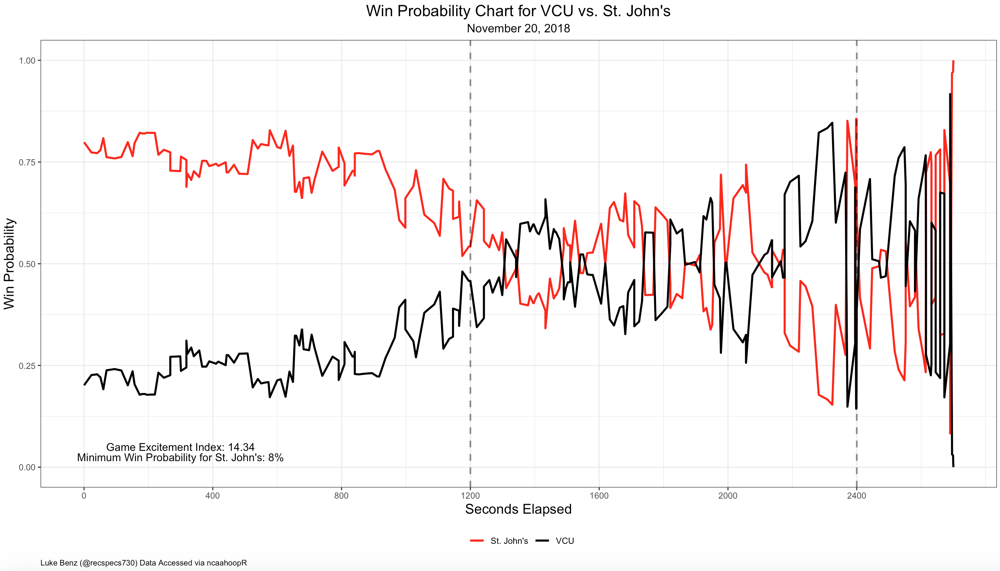

## Introduction
One of the NCAA Men's Basketball metrics I've been fascinated with lately is that of [Game Excitement Index](https://sports.sites.yale.edu/game-excitement-index-part-ii). Game Excitement Index (GEI) attempts to quantify how exciting a particular game was after it has been played. Related metrics have been implemented for [NFL games](http://archive.advancedfootballanalytics.com/2009/06/best-games-of-decade.html) by Brian Burke, [NBA games](http://www.inpredictable.com/2014/04/an-exciting-first-round-so-far.html) by InPredict (Mike Beuoy), and for [March Madness](https://fivethirtyeight.com/features/how-our-march-madness-predictions-work/) by FiveThirtyEight. One can compute GEI for college basketball games using my [`ncaahoopR`](https://github.com/lbenz730/ncaahoopR) package, which I define as follows:

$$
\text{GEI} = \frac{2400}{t}\sum_{i = 2}^n |p_i - p_{i-1}|
$$
where $t$ is the length of the game (in seconds), $n$ is the number of plays in the game, and $p_i$ is the home team's win probability on play $i$ of the game. One can think of GEI as a measure of the length of the win probability curve if it were to be unwound, normalized to the length of a standard regulation game. The reason I choose to normalize the length of games is that I don't want sloppy "boring" games which simply happen to go to 2 or 3 overtimes to be pegged as more exciting. In general, this small normalization has little effect, as games that go deep into overtime are generally pretty exciting to begin with. Through this article, I hope to explore which games, teams, and conferences have produced the most exciting basketball this season, while showing off how one can use `ncaahoopR` to answer interesting college basketball questions.

## Obtaining the Data
The below code uses `ncaahoopR` to 

* Get each team's schedule
* Compute GEI for each game this season

Note that a complete list of team's can be found in the `ids` data frame built into the package.
```{r, message = F, eval = F}
library(ncaahoopR)
### Scrape All Schedules
i <- 1
for(team in ids$team) {
  print(paste("Getting Team:", i, " of ", 353))
  schedule <- get_schedule(team) %>%
    filter(date < Sys.Date()) %>%
    mutate("team" = team) 
  if(i == 1) {
    master <- schedule
  }else{
    master <- rbind(master, schedule)
  }
  i <- i + 1
}

### Get Unique Game IDs
game_ids <- 
  filter(master, !duplicated(game_id)) %>% 
  pull(game_id) %>% 
  unique()

### Compute GEI for Each Game
n <- length(game_ids)
df <- data.frame("game_id" = game_ids,
                 "gei" = NA)
for(i in 1:nrow(df)) {
  print(paste("GEI:", i, "of", n))
  df$gei[i] <- game_excitement_index(game_ids[i])
}
master <- left_join(master, df, by = "game_id")
```


```{r, echo = F, message = F, warning = F}
library(ncaahoopR)
library(knitr)
master <- read.csv("master.csv", as.is = T)
```

## Analysis
Below is a histogram of the Game Excitement Index for the 2018-19 season (for all games play-by-play data is avaiable). Through the first 6 weeks of the season, GEI has a mean of roughly 3.6 and standard deviation of about 2.6. GEI appears to follow some sort of Gamma distribution. The distribution is skewed right, with over 62 percent of games registing GEI less than 4. 
```{r fig1, echo = F, message = F, warning = F, fig.align= "center"}
master_unique <- filter(master, !duplicated(game_id))
ggplot(master_unique, aes(x = gei)) + 
  geom_histogram(bins = 50, fill = "orange", col = "black") +
  theme_bw() + 
  theme(plot.title = element_text(size = 16, hjust = 0.5),
        plot.subtitle = element_text(size = 12, hjust = 0.5),
        axis.title = element_text(size = 14)) + 
  labs(x = "Game Excitement Index",
       y = "Count",
       title = "Histogram of Game Excitement Index",
       subtitle = "11/06/2018 - 12/21/2018")
```

We can see looking by the plot above that very few games have GEI greater than 10. In fact, 10 is the 99th percentile for GEI, and through 12/21/2018, only 23 games have achieved such a mark. Below are the most exciting games of the season.

```{r, echo = F, message = F, warning = F}
master <- inner_join(master, select(dict, ESPN, conference), by = c("team" = "ESPN"))
tmp <- select(master_unique, team, opponent, date, location, team_score, opp_score, gei) %>%
  arrange(desc(gei)) %>% 
  filter(gei > 10) %>%
  mutate(gei = round(gei, 2))
kable(tmp)
```

Let's take a closer look at the most exciting game of the season, [VCU vs. St. John's, an OT thriller in the Legend's Classic championship game](https://www.rumbleinthegarden.com/2018/11/20/18105658/st-johns-vcu-final-legends-classic-champions-87-86-ot), during Thanksgiving "Feast Week". We can make the win probability chart for the game using the function ``gg_wp_chart()``, as follows.
```{r, eval = F}
gg_wp_chart(game_id = 401096927, home_col = "black", away_col = "red")
```



Next, we can look at which teams have the highest and lowest average GEI. Due to the skewed nature of the GEI distribution, it probably makes most sense to rank teams by median GEI. We can also classify games into a few different categories based on their GEI:

* __Heart Pounders__: GEI > 8
* __Thrillers__: 4 < GEI $\leq$ 8
* __Average Games__: 1 < GEI $\leq$ 4
* __Duds__: GEI < 1

#### Most Exciting Teams
```{r, echo = F}
gei_leaderboard <- group_by(master, team) %>%
  summarise("median_gei" = round(median(gei, na.rm = T), 2),
            "mean_gei" = round(mean(gei, na.rm = T), 2),
            "max_gei" = round(max(gei, na.rm = T), 2),
            "min_gei" = round(min(gei, na.rm = T), 2),
            "heart_pounders" = sum(gei > 8, na.rm = T),
            "thrillers" = sum(gei <= 8 & gei > 4, na.rm = T),
            "average_games" = sum(gei <= 4 & gei > 1, na.rm = T),
            "duds" = sum(gei <= 1, na.rm = 1)) %>%
  arrange(desc(median_gei))

kable(head(gei_leaderboard, 20))

```

#### Least Exciting Teams
```{r, echo=F}
kable(head(arrange(gei_leaderboard, median_gei), 20))
```

Perhaps not suprisingly, many of the least exciting teams so far are MEAC and SWAC teams, often scheduling buy-games (and getting blown-out) against high-major opponents. Teams like Duke, UVA, and Texas Tech are likely on the list for the same reason--scheduling and destroying many weaker opponents. Duke's appearance on this list is actually a testament to it's domiance this season. Even having Kentucky, Texas Tech, Auburn, Indiana, and Gonzaga on it's non-conference schedule, it's level of dominance means Duke's win probability charts flatline early and are marked by low GEI scores. This also shows a limitation of GEI to show what is exciting. Against most opponents, a team like Duke will still be fairly heavily favored when the score is close and as such, won't be able to wrack up as high of a Game Excitement Index. Perhaps at this stage of the season, GEI is best used to rank mid-major teams, and it would be wise to wait until conference play begins to evalaute high-major teams on this metric. 


#### GEI Game Types by Conference
```{r fig2, echo=F, fig.align="center", fig.height = 9, fig.width=15}
games_class <- 
  filter(master, !is.na(gei)) %>%
  mutate("game_class" = 
           case_when(
             gei > 8 ~ "4", 
             gei <= 8 & gei > 4 ~ "3",
             gei <= 4 & gei > 1 ~ "2",
             gei < 1 ~ "1"
           ))

gg_color_hue <- function(n) {
  hues = seq(15, 375, length = n + 1)
  hcl(h = hues, l = 65, c = 100)[1:n]
}

ggplot(games_class, aes(x = game_class, fill = game_class)) + 
  facet_wrap(~conference, ncol = 8) + 
  geom_bar() +
  theme_bw() + 
  theme(plot.title = element_text(size = 28, hjust = 0.5),
        plot.subtitle = element_text(size = 18, hjust = 0.5),
        axis.title = element_text(size = 22),
        axis.text.x = element_blank(),
        axis.ticks.x = element_blank(),
        legend.position = "bottom") + 
  labs(x = "",
       y = "Count",
       fill = "Game Class",
       title = "Classification of Game Type by Game Excitement Index",
       subtitle = "11/06/2018 - 12/21/2018") + 
  scale_fill_manual(values = gg_color_hue(4), labels = c("Dud", "Average Game",
                                                         "Thriller", "Heart Pounder"))
  
```

#### Most Exciting Game by Date
Finally, one can look at the most exciting game on each day of the season. I got the idea for the below chart from Jordan Sperber's [look at the best ranked games each day per KenPom FanMatch](https://twitter.com/hoopvision68/status/1054509454064926720), which seeks to quantify the quality of a game _before_ it is played.

```{r fig3, echo = F, warning = F, message = F, fig.align="center", fig.height= 12, fig.width = 20}
library(ggrepel)
x <- group_by(master, date) %>%
  summarise("best_game" = max(gei, na.rm = T)) %>%
  filter(as.Date(date) >= "2018-11-06") %>% 
  inner_join(select(master_unique, team, opponent, gei), by = c("best_game" = "gei")) 

ggplot(x, aes(x = as.Date(date), y = best_game, fill = best_game)) +
  geom_label_repel(aes(label = paste0(team, " vs.\n", opponent, "\n", round(best_game,2))), alpha = 0.8) + 
  
  theme_bw() + 
  theme(plot.title = element_text(size = 36, hjust = 0.5),
        plot.subtitle = element_text(size = 28, hjust = 0.5),
        axis.title = element_text(size = 24),
        axis.text = element_text(size = 18),
        legend.position = "bottom") + 
  labs(x = "Date",
       y = "Game Excitement Index",
       fill = "GEI",
       title = "Most Exciting Game by Date",
       subtitle = "11/06/2018 - 12/21/2018")  + 
  scale_fill_continuous(low = "blue", high = "red")
```

By no means is GEI meant to be a perfect metric, and it might fail to capture important aspects of the game that a given individual might find to be exciting. That being said, I think it does a pretty good job of capturing a lot of what makes games fun to watch, and helps raise awareness of a lot of good mid-major basketball that often flies under the radar. I'll keep updating these materials as conference play kicks off in the coming weeks to see if/how the metric changes, but for now, we can sit back, relax, and appreciate some good college hoops.